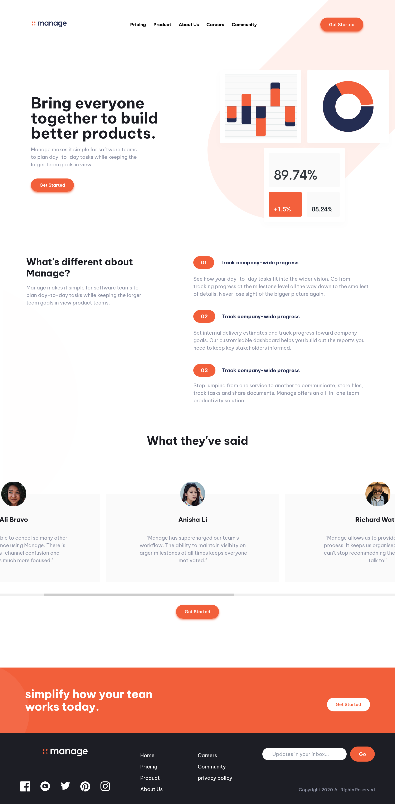

# Frontend Mentor - Manage landing page solution

This is a solution to the [Manage landing page challenge on Frontend Mentor](https://www.frontendmentor.io/challenges/manage-landing-page-SLXqC6P5). Frontend Mentor challenges help you improve your coding skills by building realistic projects. 

## Table of contents

- [Overview](#overview)
  - [The challenge](#the-challenge)
  - [Screenshot](#screenshot)
  - [Links](#links)
- [My process](#my-process)
  - [Built with](#built-with)
  - [What I learned](#what-i-learned)
  - [Continued development](#continued-development)
  - [Useful resources](#useful-resources)
- [Author](#author)
- [Acknowledgments](#acknowledgments)


## Overview

### The challenge

Users should be able to:

- View the optimal layout for the site depending on their device's screen size
- See hover states for all interactive elements on the page
- See all testimonials in a horizontal slider
- Receive an error message when the newsletter sign up `form` is submitted if:
  - The `input` field is empty
  - The email address is not formatted correctly

### Screenshot




### Links

- Solution URL: [Add solution URL here](https://your-solution-url.com)
- Live Site URL: [Add live site URL here](https://your-live-site-url.com)

## My process
I downloaded the design files for the manage lading page challenge.
created a folder for the project which includes the images, css, html, javascript etc.
i started with and wrote all the html needed to give it a proper structure before i added css with the tailwind css frame work. Gave the elements that required interaction e.g hamgurger menu
an Id ```  
wrote the game script to make it response. Then i checked if it looked good on other browser apps.
And after updating My README.md i'll amke a repo on my github.

### Built with

- Semantic HTML5 markup
- Vanilla JavaScript
- Mobile-first workflow
- [Tailwind CSS](https://tailwindcss.com/) - Tailwind framwork


### What I learned

-While trying to complete this challenge, I had my first experience with horizontal scrolling and i had to learn how to implement it.
before a horizontal scroll bar can work, there has to be an overflow. one way of archiveing is using 

```css
.container {
white-space: nowrap;
}
``` 
although i didn' go with that option. 
below is the code snippet of my first time implementing a horizontal scrollbar

```html (tailwind css)
```
  <div class="lg:h-[60%]  hidden overflow-x-auto scrollbar-thin  lg:flex flex-nowrap md:gap-5     items-center">
                        <div class="text-center bg-neutral-Vary_Light_Gray py-6 px-9">
                            <div class="flex justify-center -mt-16">
                                
                            </div>
                            <h1 class="font-bold text-xl text-neutral-Very_Dark_Blue mt-7">
                                Ali Bravo
                            </h1>
                            <p class=" w-[30pc] px-16 text-neutral-Dark_Grayish_Blue my-8">
                                "We have been able to concel so many
                                other subscriptions since using Manage.
                                There is no more cross-channel confusion
                                and everyone is much more focused."
                            </p>
                        </div>
```
-moving on I encounted another first hand issue, which was adding background-Image using tailwind css. A class for adding a bg image isn't readily available on tailwind so i had to add my own custom css properties which also it responsive. below is a code snippet:

```css

 @media (max-width:720px) {
      .bgImg {
        background-position-y: -2%;
        background-position-x: 15px;
        background-size: 120%;
      }

      .bgImg2{
        background-image:  url("img/bg-tablet-pattern.svg");
        background-repeat: no-repeat;
        background-size: 20pc;
        background-position-y: 25%;
        background-position-x: 420%;
      }
```

-Before i realised i was supposed to also make the mobile screen horizontal scroll for the testimonials i have already created an auoto moving slide with an indicator using Javascript. It was my first time doing this i was so proud of it i decided to leave it at that. here's the code for it

```js
let slideIndex = 0;
const showSlides = () => {
    let i;
    let slides = document.getElementsByClassName("slides");
    let indicator = document.getElementsByClassName("indicator");
    for(i = 0; i < slides.length; i++){
        slides[i].classList.add("hidden")
    }

    slideIndex++;
    
    if(slideIndex > slides.length){
        slideIndex = 1;
    }

    for(i = 0; i< indicator.length; i++){
         indicator[i].className = indicator[i].className.replace("bg-primary-Bright_Red", "bg-white");
    }
    slides[slideIndex-1].classList.remove("hidden")
    indicator[slideIndex-1].classList.replace("bg-white", "bg-primary-Bright_Red");
    setTimeout(showSlides, 2000);
};

```

### Continued development

I have the basic knowledge for responsive screens but i wante to further my learning on it as i am not so experienced with it. I also want to get better with tailwind css as I enjoy using the framework it definately helps me work faster.


### Useful resources

- [w3 schools](https://www.w3schools.com/howto/tryit.asp?filename=tryhow_js_slideshow_auto) 
-This helped me implent the mobile auto slider 

- [Tailwind documentation](https://www.tailwindcss.com) - This is an amazing doc which helped me understand the syntax for tailwind css and its features.


## Author

- Github - [Osaz Owie](https://github.com/OsazeOwie)
- Frontend Mentor - [@OsazeOwie](https://www.frontendmentor.io/profile/OsazeOwie)
- Gmail - [Osaze Owie](osazeowies0@gmail.com)


## Acknowledgments

- A shoutout to Brad from youtube who made a tailwind [crash course](https://youtu.be/dFgzHOX84xQ)
that's where i got the solution for adding a background-img with tailwind css.

- And also to one of my favourites [net ninja tailwind crash course](https://youtu.be/bxmDnn7lrnk) whose crash course helped me get familiar with tailwind css.


